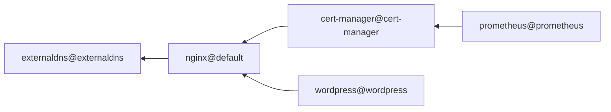

# Depends On

```mermaid
graph RL
	nginx_default["nginx@default"] --> externaldns_externaldns["externaldns@externaldns"]
	cert-manager_cert-manager["cert-manager@cert-manager"] --> nginx_default["nginx@default"]
	wordpress_wordpress["wordpress@wordpress"] --> nginx_default["nginx@default"]
	prometheus_prometheus["prometheus@prometheus"] --> cert-manager_cert-manager["cert-manager@cert-manager"]
```